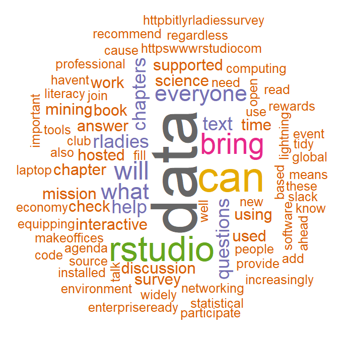

<<<<<<< HEAD
---
title: "Introduction to Text Mining with R"
author: RLadies Philadelphia
output:
  beamer_presentation:
    includes:
      in_header: tex_style.tex
fontsize: 10pt
---

# Today's "bookclub"

<!-- Set global chunk options... -->
```{r setup, include = FALSE}
knitr::opts_chunk$set(echo = TRUE, tidy=FALSE, eval=TRUE, warning=FALSE, message=FALSE, fig.align="center", out.width = '100%')
```
* Chapters 1 & 2 of _"Text Mining with R: A Tidy Approach"_ by Julia Silge and David Robinson https://www.tidytextmining.com/
* Content overview
* Work together in small groups

```{r, out.width = "70px", fig.align = 'center', echo = FALSE}
knitr::include_graphics("images/cover.png")
```

***

# The tidy text format

* Some keywords
    + **token** = meaningful unit of text
    + **tokenisation** = splitting text into tokens
    + **n-gram** = adjacent sequence of n items from sample of text
        + unigram, bigram, trigrams...
    + **regex** = "regular expression" = sequence of characters defining a search pattern

* What is "the tidy text format"?
    + one-token-per-row
    + dplyr, ggplot2
  
```{r echo = FALSE, results = 'hide'}
library(dplyr)
library(tidytext)
library(janeaustenr)
library(dplyr)
library(stringr)
library(ggplot2)
library(gutenbergr)
library(tidyr)
library(scales)
library(wordcloud)
library(reshape2)
```

*** 

# A minimal example

```{r}
text <- c("Because I could not stop for Death -",
          "He kindly stopped for me -",
          "The Carriage held but just Ourselves -",
          "and Immortality")
text_df <- data_frame(line = 1:4, text = text)
text_df
```

***

# Tokenisation

* unnest_tokens() from tidytext to tokenize
    + words (default)
    + characters
    + n-grams
    + sentences
    + lines
    + paragraphs
    + regex pattern separation
    
```{r}
head(text_df %>%
  unnest_tokens(word, text))
```

*** 

# Processing austen_books()

* austen_books() from janeaustenr
* mutate to add
    + line numbers for each row
    + chapter (w/ cumulative sum of regex string finds)

```{r}
original_books <- austen_books() %>%
  group_by(book) %>%
  mutate(linenumber = row_number(),
         chapter = cumsum(str_detect(text,
                          regex("^chapter [\\divxlc]",
                                ignore_case = TRUE)))) %>%
  ungroup()
original_books[1,]
```

*** 

# Processing austen_books()

* tokenise words

```{r}
tidy_books <- original_books %>%
  unnest_tokens(word, text)
head(tidy_books)
```
```{r include = FALSE}
head(data_frame(text = prideprejudice) %>% 
  unnest_tokens(sentence, text, token = "sentences"))
```

*** 

# stop_words

* stop_words from tidytext
* purpose?
* remove stop_words with an antijoin

```{r}
tidy_books <- tidy_books %>%
  anti_join(stop_words)
```

```{r, out.width = "100px", fig.align = 'center', echo = FALSE}

```


*** 

# The most frequent words

```{r}
tidy_books %>%
  count(word, sort = TRUE) 
```

***

# The most frequent words

```{r fig.width = 6, fig.height = 3, echo = FALSE}
tidy_books %>%
  count(word, sort = TRUE) %>%
  filter(n > 600) %>%
  mutate(word = reorder(word, n)) %>%
  ggplot(aes(word, n)) +
  geom_col() +
  xlab(NULL) +
  coord_flip()
```

*** 

# Project Gutenberg

* 1971
* https://www.gutenberg.org/
  + 56,000 ebooks
  + public domain / expired copyright

***

# gutenbergr

* gutenbergr package
  + https://ropensci.org/tutorials/gutenbergr_tutorial/
* Search gutenberg_metadata
```{r results = 'hide'}
head(gutenberg_metadata %>%
  filter(author == "Wells, H. G. (Herbert George)"))
head(gutenberg_works(author == "Wells, H. G. (Herbert George)"))
```

* Download by id

```{r}
hgwells <- gutenberg_download(c(35, 36, 5230, 159))
bronte <- gutenberg_download(c(1260, 768, 969, 9182, 767))
```

```{r results = 'hide', echo = FALSE}
tidy_hgwells <- hgwells %>%
  unnest_tokens(word, text) %>%
  anti_join(stop_words)
tidy_hgwells %>%
  count(word, sort = TRUE)

tidy_bronte <- bronte %>%
  unnest_tokens(word, text) %>%
  anti_join(stop_words)
tidy_bronte %>%
  count(word, sort = TRUE)
```

***

# Word frequencies for Jane Austen, the Brontë sisters, and H.G. Wells
```{r echo = FALSE, results = 'hide'}
frequency <- bind_rows(mutate(tidy_bronte, author = "Bronte Sisters"),
                       mutate(tidy_hgwells, author = "H.G. Wells"),
                       mutate(tidy_books, author = "Jane Austen")) %>%
  mutate(word = str_extract(word, "[a-z']+")) %>%
  count(author, word) %>%
  group_by(author) %>%
  mutate(proportion = n / sum(n)) %>%
  select(-n) %>% 
  spread(author, proportion) %>%
  gather(author, proportion, `Bronte Sisters`:`H.G. Wells`)
```

```{r echo = FALSE}
ggplot(frequency, aes(x = proportion, y = `Jane Austen`,
                      color = abs(`Jane Austen` - proportion))) +
  geom_abline(color = "gray40", lty = 2) +
  geom_jitter(alpha = 0.1, size = 2.5, width = 0.3, height = 0.3) +
  geom_text(aes(label = word), check_overlap = TRUE, vjust = 1.5) +
  scale_x_log10(labels = percent_format()) +
  scale_y_log10(labels = percent_format()) +
  scale_color_gradient(limits = c(0, 0.001),
                       low = "darkslategray4", high = "gray75") +
  facet_wrap(~author, ncol = 2) +
  theme(legend.position="none") +
  labs(y = "Jane Austen", x = NULL)
```

*** 

# Sentiment analysis

* aka "opinion mining"
* computationally identifying & categorizing sentiment in text

* Some keywords  
    + **lexicon** = inventory of words
    + **sentiment** = emotional content

***

# The sentiments dataset (tidytext)

* contains several sentiment lexicons

```{r}
unique(sentiments$lexicon)
```
* Limitations of this approach?
    + appropriateness
    + unigrams
        + *"It was not good"*

***

# The lexicons

* **AFINN** (Finn Årup Nielsen)
    + -5 to 5
    + manually labelled
```{r}
head(get_sentiments("afinn"))
```  

***
# The lexicons

* **bing** (Bing Liu et al)
    + positive/negative
```{r}
head(get_sentiments("bing"))
```  

***

# The lexicons

* **nrc** (Saif Mohammad and Peter Turney)
    + positive/negative
    + anger, fear, anticipation, trust, surprise, sadness, joy, disgust
    + crowdsourced manual annotations
```{r}
head(get_sentiments("nrc"))
```  

*** 
# Most frequent words by sentiment

* Most frequent "joy" words in Emma

```{r}
nrc_joy <- get_sentiments("nrc") %>% 
  filter(sentiment == "joy")
tidy_books %>%
  filter(book == "Emma") %>%
  inner_join(nrc_joy) %>%
  count(word, sort = TRUE)
```

*** 

# Sentiment change across text

* 80 line chunks

```{r}
jane_austen_sentiment <- tidy_books %>%
  inner_join(get_sentiments("bing")) %>%
  count(book, index = linenumber %/% 80, sentiment) %>%
  spread(sentiment, n, fill = 0) %>%
  mutate(sentiment = positive - negative)
jane_austen_sentiment
```

*** 

# Sentiment change across Austen novels

```{r echo = FALSE}
ggplot(jane_austen_sentiment, aes(index, sentiment, fill = book)) +
  geom_col(show.legend = FALSE) +
  facet_wrap(~book, ncol = 2, scales = "free_x")
```

*** 

# Most frequent positive versus negative words

```{r}
bing_word_counts <- tidy_books %>%
  inner_join(get_sentiments("bing")) %>%
  count(word, sentiment, sort = TRUE)

head(bing_word_counts)
```

```{r include = FALSE}
bing_word_counts %>%
  group_by(sentiment) %>%
  top_n(10) %>%
  ungroup() %>%
  mutate(word = reorder(word, n)) %>%
  ggplot(aes(word, n, fill = sentiment)) +
  geom_col(show.legend = FALSE) +
  facet_wrap(~sentiment, scales = "free_y") +
  labs(y = "Contribution to sentiment",
       x = NULL) +
  coord_flip()
```

*** 
# Custom stop words

* "miss" is currently misanalysed...

```{r}
custom_stop_words <- bind_rows(data_frame(word = c("miss"), 
                                          lexicon = c("custom")), 
                               stop_words)

head(custom_stop_words)
```

*** 

# Pipe data into a wordcloud plot...

* wordcloud package
```{r out.width = '50%'}
tidy_books %>%
  anti_join(custom_stop_words) %>%
  inner_join(get_sentiments("bing")) %>%
  count(word, sentiment, sort = TRUE) %>%
  acast(word ~ sentiment, value.var = "n", fill = 0) %>%
  comparison.cloud(colors = c("red", "blue"),
                   max.words = 100)
```

```{r include = FALSE}
tidy_books %>%
  anti_join(custom_stop_words) %>%
  count(word) %>%
  with(wordcloud(word, n, max.words = 100))
```

***
# In small groups

* Work through Section 1.5 (Chapter 1), especially the code chunk below:
```{r}
frequency <- bind_rows(mutate(tidy_bronte, author = "Bronte Sisters"),
                       mutate(tidy_hgwells, author = "H.G. Wells"),
                       mutate(tidy_books, author = "Jane Austen")) %>%
  mutate(word = str_extract(word, "[a-z']+")) %>%
  count(author, word) %>%
  group_by(author) %>%
  mutate(proportion = n / sum(n)) %>%
  select(-n) %>% 
  spread(author, proportion) %>%
  gather(author, proportion, `Bronte Sisters`:`H.G. Wells`)
```
* Pick a novel from the Gutenberg collection, and discover...
    + the most frequent words
    + the most frequent "trust" words using the nrc lexicon
    + how the sentiment changes across the novel using the bing lexicon
* If you have time, create a data visualisation for one of these text mining exercises


***
# References

* Silge, Julia and David Robinson (2017), _Text Mining with R: A Tidy Approach_, O'Reilly / https://www.tidytextmining.com
    + and references therein: https://www.tidytextmining.com/references.html


***

# Dracula: the most frequent words

```{r}
gutenberg_works(title == "Dracula")$gutenberg_id
dracula <- gutenberg_download(345)
dracula_words <- dracula %>%
  mutate(linenumber = row_number(),
         chapter = cumsum(str_detect(text, 
                          regex("^chapter [\\divxlc]",
                                ignore_case = TRUE))))  %>%
  unnest_tokens(word, text)
head(dracula_words %>%
  anti_join(stop_words) %>%
  count(word, sort = TRUE)) 
```

***

# Dracula: the most frequent "trust" words using the nrc lexicon

```{r}
nrc_trust <- get_sentiments("nrc") %>% 
  filter(sentiment == "trust")
dracula_words %>%
  inner_join(nrc_trust) %>%
  count(word, sort = TRUE)
```

***

# Dracula: how the sentiment changes across the novel using the bing lexicon

```{r out.width = '60%'}
dracula_sentiment <- dracula_words %>%
  inner_join(get_sentiments("bing")) %>%
count(index = linenumber%/%80, sentiment) %>%
  spread(sentiment, n,
fill = 0) %>% mutate(sentiment = positive - negative)
ggplot(dracula_sentiment, aes(index, sentiment, fill=sentiment)) +
  scale_fill_gradient(low = "#230105", high = "#ff0019") +
  geom_col(show.legend = FALSE)
```


***

# Dracula: a wordcloud

```{r out.width = '65%'}
red_palette <- brewer.pal(8,"RdGy")
dracula_words %>%
  anti_join(stop_words) %>%
  count(word) %>%
  with(wordcloud(word, n, min.freq=6, max.words = 250,
          random.order=FALSE, rot.per=.15, colors=red_palette))
```
***
# Work through each line in the code chunk below from Section 1.5:
* h/t Alice!  
    + bind_rows is like rbind() but in dplyr, add an author variable to each tibble
    + mutate is changing the word variable by looking for the regex starting with lower case letters
    + counting words by author
    + dplyr group_by gives each observation a group and performs next functions on those groups
    + mutate creates proportion variable (count of each word divided by the total counts)
    + select(-n) removes the n (count) variable from the tibble
    + spread() is creating a wide format table where each author has a variable
    + gather() is pulling back together so Austen has a variable, but Bronte and Wells are in long format

```{r echo = FALSE}
frequency <- bind_rows(mutate(tidy_bronte, author = "Bronte Sisters"),
                       mutate(tidy_hgwells, author = "H.G. Wells"),
                       mutate(tidy_books, author = "Jane Austen")) %>%
  mutate(word = str_extract(word, "[a-z']+")) %>%
  count(author, word) %>%
  group_by(author) %>%
  mutate(proportion = n / sum(n)) %>%
  select(-n) %>% 
  spread(author, proportion) %>%
  gather(author, proportion, `Bronte Sisters`:`H.G. Wells`)
```

***
# Packages

```{r}
library(dplyr)
library(tidytext)
library(janeaustenr)
library(dplyr)
library(stringr)
library(ggplot2)
library(gutenbergr)
library(tidyr)
library(scales)
library(wordcloud)
library(reshape2)
```

***

# Potential problems

* Problem loading wordcloud with R version 3.3.3
  + https://stackoverflow.com/questions/39885408/dependency-slam-is-not-available-when-installing-tm-package
  + Probably better to update R?

```{r}
# install.packages('devtools')
# library(devtools)
# slam_url <- "https://cran.r-project.org/src/contrib/...
# ...Archive/slam/slam_0.1-37.tar.gz"
# install_url(slam_url)
```

***

# Potential problems

* "Error in summarise_impl(.data, dots) : invalid argument type"
* Update dplyr
```{r}
head(data_frame(text = prideprejudice) %>% 
  unnest_tokens(sentence, text, token = "sentences"))
```
=======
---
title: "Introduction to Text Mining with R"
author: RLadies Philadelphia
output:
  beamer_presentation:
    includes:
      in_header: tex_style.tex
fontsize: 10pt
---

# Today's "bookclub"

<!-- Set global chunk options... -->
```{r setup, include = FALSE}
knitr::opts_chunk$set(echo = TRUE, tidy=FALSE, eval=TRUE, warning=FALSE, message=FALSE, fig.align="center", out.width = '100%')
```
* Chapters 1 & 2 of _"Text Mining with R: A Tidy Approach"_ by Julia Silge and David Robinson https://www.tidytextmining.com/
* Content overview
* Work together in small groups

```{r, out.width = "70px", fig.align = 'center', echo = FALSE}
knitr::include_graphics("images/cover.png")
```

***

# The tidy text format

* Some keywords
    + **token** = meaningful unit of text
    + **tokenisation** = splitting text into tokens
    + **n-gram** = adjacent sequence of n items from sample of text
        + unigram, bigram, trigrams...
    + **regex** = "regular expression" = sequence of characters defining a search pattern

* What is "the tidy text format"?
    + one-token-per-row
    + dplyr, ggplot2
  
```{r echo = FALSE, results = 'hide'}
library(dplyr)
library(tidytext)
library(janeaustenr)
library(dplyr)
library(stringr)
library(ggplot2)
library(gutenbergr)
library(tidyr)
library(scales)
library(wordcloud)
library(reshape2)
```

*** 

# A minimal example

```{r}
text <- c("Because I could not stop for Death -",
          "He kindly stopped for me -",
          "The Carriage held but just Ourselves -",
          "and Immortality")
text_df <- data_frame(line = 1:4, text = text)
text_df
```

***

# Tokenisation

* unnest_tokens() from tidytext to tokenize
    + words (default)
    + characters
    + n-grams
    + sentences
    + lines
    + paragraphs
    + regex pattern separation
    
```{r}
head(text_df %>%
  unnest_tokens(word, text))
```

*** 

# Processing austen_books()

* austen_books() from janeaustenr
* mutate to add
    + line numbers for each row
    + chapter (w/ cumulative sum of regex string finds)

```{r}
original_books <- austen_books() %>%
  group_by(book) %>%
  mutate(linenumber = row_number(),
         chapter = cumsum(str_detect(text,
                          regex("^chapter [\\divxlc]",
                                ignore_case = TRUE)))) %>%
  ungroup()
original_books[1,]
```

*** 

# Processing austen_books()

* tokenise words

```{r}
tidy_books <- original_books %>%
  unnest_tokens(word, text)
head(tidy_books)
```
```{r include = FALSE}
head(data_frame(text = prideprejudice) %>% 
  unnest_tokens(sentence, text, token = "sentences"))
```

*** 

# stop_words

* stop_words from tidytext
* purpose?
* remove stop_words with an antijoin

```{r}
tidy_books <- tidy_books %>%
  anti_join(stop_words)
```

```{r, out.width = "100px", fig.align = 'center', echo = FALSE}

```


*** 

# The most frequent words

```{r}
tidy_books %>%
  count(word, sort = TRUE) 
```

***

# The most frequent words

```{r fig.width = 6, fig.height = 3, echo = FALSE}
tidy_books %>%
  count(word, sort = TRUE) %>%
  filter(n > 600) %>%
  mutate(word = reorder(word, n)) %>%
  ggplot(aes(word, n)) +
  geom_col() +
  xlab(NULL) +
  coord_flip()
```

*** 

# Project Gutenberg

* 1971
* https://www.gutenberg.org/
  + 56,000 ebooks
  + public domain / expired copyright

***

# gutenbergr

* gutenbergr package
  + https://ropensci.org/tutorials/gutenbergr_tutorial/
* Search gutenberg_metadata
```{r results = 'hide'}
head(gutenberg_metadata %>%
  filter(author == "Wells, H. G. (Herbert George)"))
head(gutenberg_works(author == "Wells, H. G. (Herbert George)"))
```

* Download by id

```{r}
hgwells <- gutenberg_download(c(35, 36, 5230, 159))
bronte <- gutenberg_download(c(1260, 768, 969, 9182, 767))
```

```{r results = 'hide', echo = FALSE}
tidy_hgwells <- hgwells %>%
  unnest_tokens(word, text) %>%
  anti_join(stop_words)
tidy_hgwells %>%
  count(word, sort = TRUE)

tidy_bronte <- bronte %>%
  unnest_tokens(word, text) %>%
  anti_join(stop_words)
tidy_bronte %>%
  count(word, sort = TRUE)
```

***

# Word frequencies for Jane Austen, the Brontë sisters, and H.G. Wells
```{r echo = FALSE, results = 'hide'}
frequency <- bind_rows(mutate(tidy_bronte, author = "Bronte Sisters"),
                       mutate(tidy_hgwells, author = "H.G. Wells"),
                       mutate(tidy_books, author = "Jane Austen")) %>%
  mutate(word = str_extract(word, "[a-z']+")) %>%
  count(author, word) %>%
  group_by(author) %>%
  mutate(proportion = n / sum(n)) %>%
  select(-n) %>% 
  spread(author, proportion) %>%
  gather(author, proportion, `Bronte Sisters`:`H.G. Wells`)
```

```{r echo = FALSE}
ggplot(frequency, aes(x = proportion, y = `Jane Austen`,
                      color = abs(`Jane Austen` - proportion))) +
  geom_abline(color = "gray40", lty = 2) +
  geom_jitter(alpha = 0.1, size = 2.5, width = 0.3, height = 0.3) +
  geom_text(aes(label = word), check_overlap = TRUE, vjust = 1.5) +
  scale_x_log10(labels = percent_format()) +
  scale_y_log10(labels = percent_format()) +
  scale_color_gradient(limits = c(0, 0.001),
                       low = "darkslategray4", high = "gray75") +
  facet_wrap(~author, ncol = 2) +
  theme(legend.position="none") +
  labs(y = "Jane Austen", x = NULL)
```

*** 

# Sentiment analysis

* aka "opinion mining"
* computationally identifying & categorizing sentiment in text

* Some keywords  
    + **lexicon** = inventory of words
    + **sentiment** = emotional content

***

# The sentiments dataset (tidytext)

* contains several sentiment lexicons

```{r}
unique(sentiments$lexicon)
```
* Limitations of this approach?
    + appropriateness
    + unigrams
        + *"It was not good"*

***

# The lexicons

* **AFINN** (Finn Årup Nielsen)
    + -5 to 5
    + manually labelled
```{r}
head(get_sentiments("afinn"))
```  

***
# The lexicons

* **bing** (Bing Liu et al)
    + positive/negative
```{r}
head(get_sentiments("bing"))
```  

***

# The lexicons

* **nrc** (Saif Mohammad and Peter Turney)
    + positive/negative
    + anger, fear, anticipation, trust, surprise, sadness, joy, disgust
    + crowdsourced manual annotations
```{r}
head(get_sentiments("nrc"))
```  

*** 
# Most frequent words by sentiment

* Most frequent "joy" words in Emma

```{r}
nrc_joy <- get_sentiments("nrc") %>% 
  filter(sentiment == "joy")
tidy_books %>%
  filter(book == "Emma") %>%
  inner_join(nrc_joy) %>%
  count(word, sort = TRUE)
```

*** 

# Sentiment change across text

* 80 line chunks

```{r}
jane_austen_sentiment <- tidy_books %>%
  inner_join(get_sentiments("bing")) %>%
  count(book, index = linenumber %/% 80, sentiment) %>%
  spread(sentiment, n, fill = 0) %>%
  mutate(sentiment = positive - negative)
jane_austen_sentiment
```

*** 

# Sentiment change across Austen novels

```{r echo = FALSE}
ggplot(jane_austen_sentiment, aes(index, sentiment, fill = book)) +
  geom_col(show.legend = FALSE) +
  facet_wrap(~book, ncol = 2, scales = "free_x")
```

*** 

# Most frequent positive versus negative words

```{r}
bing_word_counts <- tidy_books %>%
  inner_join(get_sentiments("bing")) %>%
  count(word, sentiment, sort = TRUE)

head(bing_word_counts)
```

```{r include = FALSE}
bing_word_counts %>%
  group_by(sentiment) %>%
  top_n(10) %>%
  ungroup() %>%
  mutate(word = reorder(word, n)) %>%
  ggplot(aes(word, n, fill = sentiment)) +
  geom_col(show.legend = FALSE) +
  facet_wrap(~sentiment, scales = "free_y") +
  labs(y = "Contribution to sentiment",
       x = NULL) +
  coord_flip()
```

*** 
# Custom stop words

* "miss" is currently misanalysed...

```{r}
custom_stop_words <- bind_rows(data_frame(word = c("miss"), 
                                          lexicon = c("custom")), 
                               stop_words)

head(custom_stop_words)
```

*** 

# Pipe data into a wordcloud plot...

* wordcloud package
```{r out.width = '50%'}
tidy_books %>%
  anti_join(custom_stop_words) %>%
  inner_join(get_sentiments("bing")) %>%
  count(word, sentiment, sort = TRUE) %>%
  acast(word ~ sentiment, value.var = "n", fill = 0) %>%
  comparison.cloud(colors = c("red", "blue"),
                   max.words = 100)
```

```{r include = FALSE}
tidy_books %>%
  anti_join(custom_stop_words) %>%
  count(word) %>%
  with(wordcloud(word, n, max.words = 100))
```

***
# In small groups

* Work through Section 1.5 (Chapter 1), especially the code chunk below:
```{r}
frequency <- bind_rows(mutate(tidy_bronte, author = "Bronte Sisters"),
                       mutate(tidy_hgwells, author = "H.G. Wells"),
                       mutate(tidy_books, author = "Jane Austen")) %>%
  mutate(word = str_extract(word, "[a-z']+")) %>%
  count(author, word) %>%
  group_by(author) %>%
  mutate(proportion = n / sum(n)) %>%
  select(-n) %>% 
  spread(author, proportion) %>%
  gather(author, proportion, `Bronte Sisters`:`H.G. Wells`)
```
* Pick a novel from the Gutenberg collection, and discover...
    + the most frequent words
    + the most frequent "trust" words using the nrc lexicon
    + how the sentiment changes across the novel using the bing lexicon
* If you have time, create a data visualisation for one of these text mining exercises


***
# References

* Silge, Julia and David Robinson (2017), _Text Mining with R: A Tidy Approach_, O'Reilly / https://www.tidytextmining.com
    + and references therein: https://www.tidytextmining.com/references.html


***

# Dracula: the most frequent words

```{r}
gutenberg_works(title == "Dracula")$gutenberg_id
dracula <- gutenberg_download(345)
dracula_words <- dracula %>%
  mutate(linenumber = row_number(),
         chapter = cumsum(str_detect(text, 
                          regex("^chapter [\\divxlc]",
                                ignore_case = TRUE))))  %>%
  unnest_tokens(word, text)
head(dracula_words %>%
  anti_join(stop_words) %>%
  count(word, sort = TRUE)) 
```

***

# Dracula: the most frequent "trust" words using the nrc lexicon

```{r}
nrc_trust <- get_sentiments("nrc") %>% 
  filter(sentiment == "trust")
dracula_words %>%
  inner_join(nrc_trust) %>%
  count(word, sort = TRUE)
```

***

# Dracula: how the sentiment changes across the novel using the bing lexicon

```{r out.width = '60%'}
dracula_sentiment <- dracula_words %>%
  inner_join(get_sentiments("bing")) %>%
count(index = linenumber%/%80, sentiment) %>%
  spread(sentiment, n,
fill = 0) %>% mutate(sentiment = positive - negative)
ggplot(dracula_sentiment, aes(index, sentiment, fill=sentiment)) +
  scale_fill_gradient(low = "#230105", high = "#ff0019") +
  geom_col(show.legend = FALSE)
```


***

# Dracula: a wordcloud

```{r out.width = '65%'}
red_palette <- brewer.pal(8,"RdGy")
dracula_words %>%
  anti_join(stop_words) %>%
  count(word) %>%
  with(wordcloud(word, n, min.freq=6, max.words = 250,
          random.order=FALSE, rot.per=.15, colors=red_palette))
```
***
# Work through each line in the code chunk below from Section 1.5:
* h/t Alice!  
    + bind_rows is like rbind() but in dplyr, add an author variable to each tibble
    + mutate is changing the word variable by looking for the regex starting with lower case letters
    + counting words by author
    + dplyr group_by gives each observation a group and performs next functions on those groups
    + mutate creates proportion variable (count of each word divided by the total counts)
    + select(-n) removes the n (count) variable from the tibble
    + spread() is creating a wide format table where each author has a variable
    + gather() is pulling back together so Austen has a variable, but Bronte and Wells are in long format

```{r echo = FALSE}
frequency <- bind_rows(mutate(tidy_bronte, author = "Bronte Sisters"),
                       mutate(tidy_hgwells, author = "H.G. Wells"),
                       mutate(tidy_books, author = "Jane Austen")) %>%
  mutate(word = str_extract(word, "[a-z']+")) %>%
  count(author, word) %>%
  group_by(author) %>%
  mutate(proportion = n / sum(n)) %>%
  select(-n) %>% 
  spread(author, proportion) %>%
  gather(author, proportion, `Bronte Sisters`:`H.G. Wells`)
```

***
# Packages

```{r}
library(dplyr)
library(tidytext)
library(janeaustenr)
library(dplyr)
library(stringr)
library(ggplot2)
library(gutenbergr)
library(tidyr)
library(scales)
library(wordcloud)
library(reshape2)
```

***

# Potential problems

* Problem loading wordcloud with R version 3.3.3
  + https://stackoverflow.com/questions/39885408/dependency-slam-is-not-available-when-installing-tm-package
  + Probably better to update R?

```{r}
# install.packages('devtools')
# library(devtools)
# slam_url <- "https://cran.r-project.org/src/contrib/...
# ...Archive/slam/slam_0.1-37.tar.gz"
# install_url(slam_url)
```

***

# Potential problems

* "Error in summarise_impl(.data, dots) : invalid argument type"
* Update dplyr
```{r}
head(data_frame(text = prideprejudice) %>% 
  unnest_tokens(sentence, text, token = "sentences"))
```
>>>>>>> 674c01053f097ea018edec1204ebdf7d43751467
